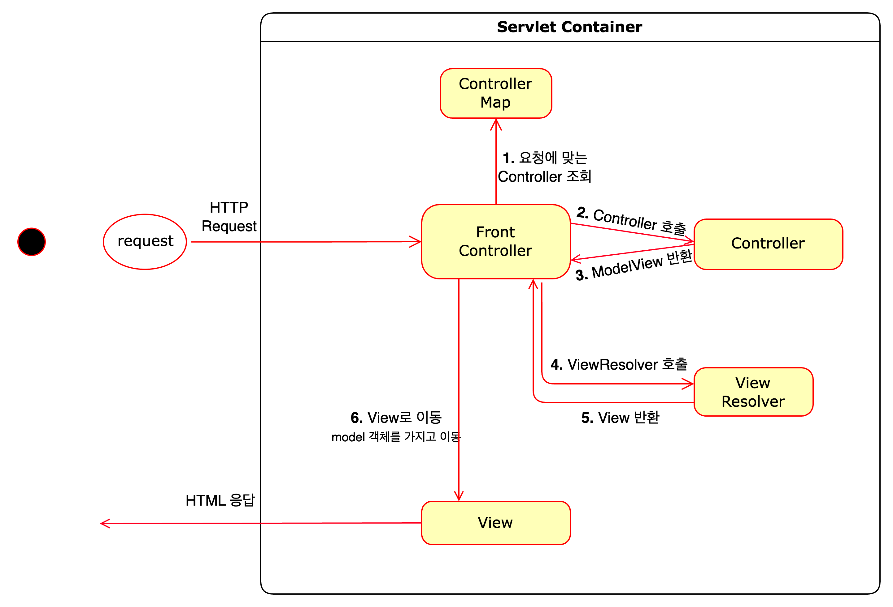

# front controller v1

### front-controller 배치
- **controller의 servlet에 종속성 제거**
  - front controller를 사용함으로써, 그 외 다른 controller까지 servlet에 의존적일 필요 없음. (HttpServletRequest, HttpServletResponse)
  - front controller를 제외한 모든 controller에 servlet 종속을 제거하고, request 객체가 아닌 별도의 Model 객체를 생성하여 명시적으로 반환.

### viewResolver 기능 추가
- **Controller마다 지정하는 View 이름에 중복 제거**
  - 각 Controller는 view의 논리이름 반환.
  - viewResolver는 prefix, suffix 을 지정하여 논리이름 -> 물리적 위치로 변환을 담당.
  - 향후 경로 변경 시, front-controller만 수정 -> 변경의 지점을 하나로 만든다.

### v1 구조

