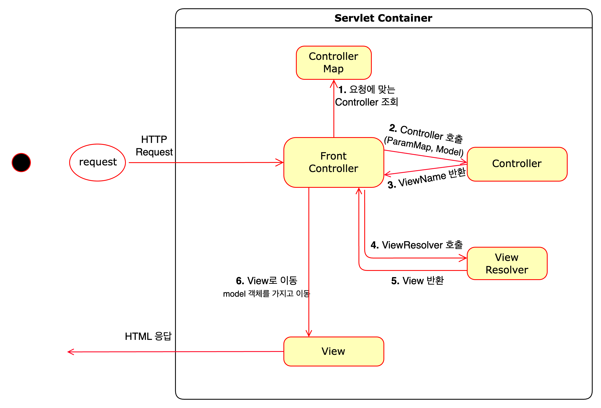

# front controller v2

### Controller의 반환 타입 변경
- **controller의 return type: view -> viewName**
  - Controller가 view 자체를 반환했던 v1과 비교하여, viewName만 반환한다.
  - model객체는 따로 넘김으로써, controller에서 비즈니스 로직을 개발하는 개발자의 편의성이 올라간다.
    - 데이터를 담는 model만 관리하고, view는 논리이름만 넘기면 되므로 편의성이 올라간다.

### v2 구조

