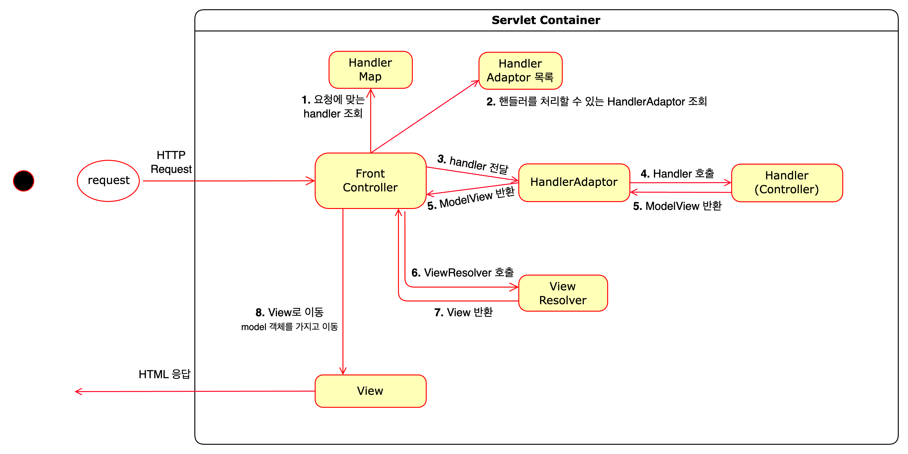

# front controller v3

### Adapter 도입
- Controller 인터페이스 확장성 및 다양한 방식의 Controller를 유연하게 처리 가능해진다.
- 핸들러 어댑터(Handler Adapter): 다양한 종류의 Handler(Controller)를 처리하기 위해 Handler Adapter를 중간 배치한다.

### v3 구조
  

- request에 맞는 Handler가 존재하는지 핸들러 매핑 정보를 통해 조회한다.  
**e.g) 클래스 레벨에 @Controller가 붙어있는 Bean을 RequestMappingHandlerMapping에서 핸들러로 인식하고 처리.**
- 조회한 핸들러를 처리하기 위한 핸들러 어댑터를 조회한다.  
**e.g) 클래스 레벨에 @Controller가 붙어있는 handler를 RequestMappingHandlerAdapter를 사용하여 호출한다.**
- 핸들러 어댑터가 존재하면, handler 정보와 함께 핸들러 어댑터를 호출하고,  
핸들러 어댑터 내부에선 실제 핸들러를 호출하여 비즈니스 로직을 처리한다.
- 처리 결과를 담은 ModelView를 반환하고, viewResolver를 통해 실제 렌더링 할 view 객체를 반환 한다.
- view를 통해 렌더링된다.

- 예시에 대한 자세한 내용은 AbstractHandlerMethodAdapter, RequestMappingHandlerAdapter, DispatcherServlet.doDispatch()을 참고함.
